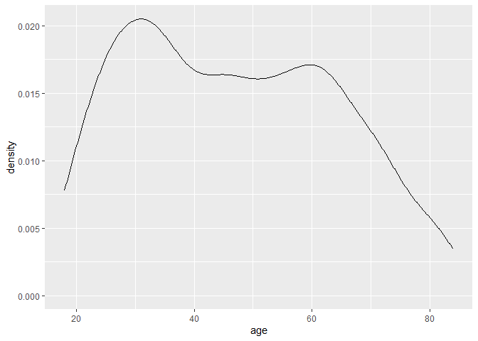

Lab 06 - Ugly charts and Simpson’s paradox
================
Insert your name here
Insert date here

### Load packages and data

``` r
library(tidyverse) 
library(dsbox)
library(mosaicData) 
library(gghighlight)
library(geomtextpath)
```

### Exercise 1 & 2

``` r
staff <- read_csv("data/instructional-staff.csv")
```

    ## Rows: 5 Columns: 12
    ## ── Column specification ────────────────────────────────────────────────────────
    ## Delimiter: ","
    ## chr  (1): faculty_type
    ## dbl (11): 1975, 1989, 1993, 1995, 1999, 2001, 2003, 2005, 2007, 2009, 2011
    ## 
    ## ℹ Use `spec()` to retrieve the full column specification for this data.
    ## ℹ Specify the column types or set `show_col_types = FALSE` to quiet this message.

``` r
staff_long <- staff %>%
  pivot_longer(cols = -faculty_type, names_to = "year") %>%
  mutate(value = as.numeric(value))

staff_long %>%
  ggplot(aes(x = year,
             y = value,
             group = faculty_type,
             color = faculty_type))+
  geom_line()+
   gghighlight(faculty_type == "Part-Time Faculty", use_direct_label = FALSE, unhighlighted_params = aes(color = NULL, alpha = 0.2), keep_scales = TRUE)+
  labs(
    title = "Trends in Instructional Staff Employment Status, 1975-2011",
    subtitle = "All Institutions, National Totals",
    y = "Percent of Total Instructional Staff"
  )+
  scale_color_discrete(name  ="faculty type")
```

    ## Warning: Tried to calculate with group_by(), but the calculation failed.
    ## Falling back to ungrouped filter operation...

<!-- -->

``` r
# I highlighted the part-time compared to others so that it is more salient in the graph. 
```

### Exercise 3

I want to find a better way to filter the country variable so that it
looks cleaner the plot. Also, I want to overlap two variables in the
same plot for the easy of comparison.

``` r
fisheries <- read_csv("data/fisheries.csv")
```

    ## Rows: 216 Columns: 4
    ## ── Column specification ────────────────────────────────────────────────────────
    ## Delimiter: ","
    ## chr (1): country
    ## dbl (3): capture, aquaculture, total
    ## 
    ## ℹ Use `spec()` to retrieve the full column specification for this data.
    ## ℹ Specify the column types or set `show_col_types = FALSE` to quiet this message.

``` r
fisheries %>%
  filter (total > 1000000) %>%
  ggplot()+
  geom_col(aes(y=reorder(country,total), x= total,fill = "total"))+
  geom_col(aes(y=reorder(country,total), x= aquaculture,fill = "aquaculture"))
```

<!-- -->

``` r
fisheries %>%
  filter (total > 1000000) %>%
  ggplot()+
  geom_col(aes(y=reorder(country,total), x= total,fill = "total"))+
  geom_col(aes(y=reorder(country,total), x= capture,fill = "capture"))
```

<!-- -->

``` r
fisheries %>%
  filter (total > 1000000) %>%
  ggplot()+
  geom_col(aes(y=reorder(country,total), x= capture,fill = "capture"))+
  geom_col(aes(y=reorder(country,total), x= aquaculture,fill = "aquaculture", alpha = 0.5))
```

<!-- -->

### Exercise 1 (Wickham)

This is observational data because there is no experimental manipulation
in this study.

### Exercise 2 (Wickham)

There are 1314 pieces of observation and they each represent a single
individual.

``` r
dim(Whickham)
```

    ## [1] 1314    3

``` r
head(Whickham)
```

    ##   outcome smoker age
    ## 1   Alive    Yes  23
    ## 2   Alive    Yes  18
    ## 3    Dead    Yes  71
    ## 4   Alive     No  67
    ## 5   Alive     No  64
    ## 6   Alive    Yes  38

### Exercise 3 (Wickham)

There are 3 variables. Outcome and smoker are discret variables while
age is a continuous variable.

``` r
ncol(Whickham)
```

    ## [1] 3

``` r
Whickham %>%
  ggplot(aes(x=outcome, fill = smoker))+
  geom_bar()
```

<!-- -->

``` r
Whickham %>%
  ggplot(aes(x=age))+
  geom_density()
```

<!-- -->

### Exercise 4 (Wickham)

I would expect the relationship between smoking status and health
outcome to be positive.

``` r
chisq.test(Whickham$outcome,Whickham$smoker)
```

    ## 
    ##  Pearson's Chi-squared test with Yates' continuity correction
    ## 
    ## data:  Whickham$outcome and Whickham$smoker
    ## X-squared = 8.7515, df = 1, p-value = 0.003093

### Exercise 5 (Wickham)

``` r
Whickham$age_cat <- ifelse(Whickham$age <= 44, "18-44", 
                           ifelse((Whickham$age > 44& Whickham$age <= 64),"45-64","65+"))
```

### Exercise 6 (Wickham)

``` r
Whickham %>%
  count(smoker, age_cat, outcome)%>%
  ggplot(aes(x=outcome, y = n, fill = smoker))+
  geom_bar(stat = "identity")+
  facet_grid(cols = vars(age_cat))
```

<!-- -->
